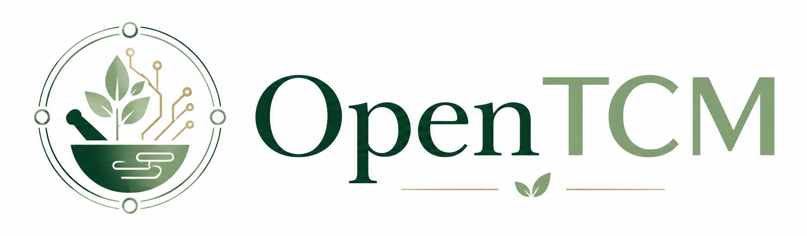
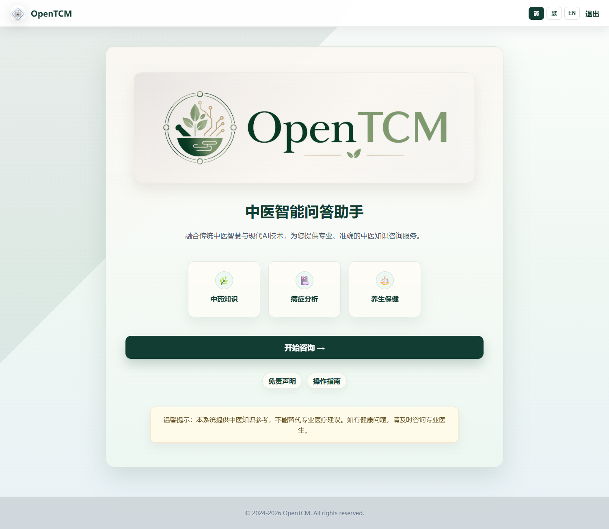
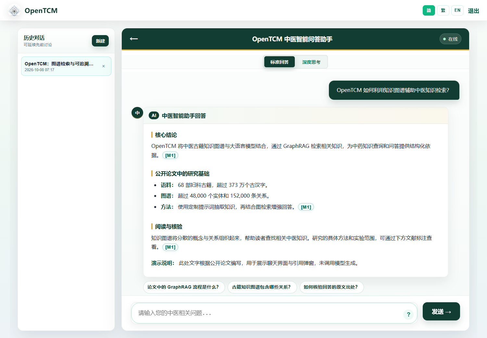
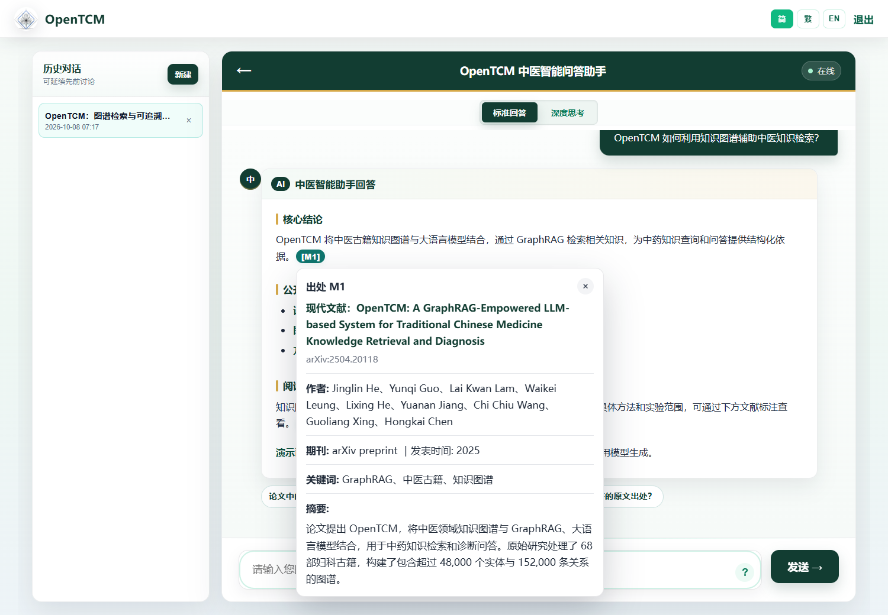
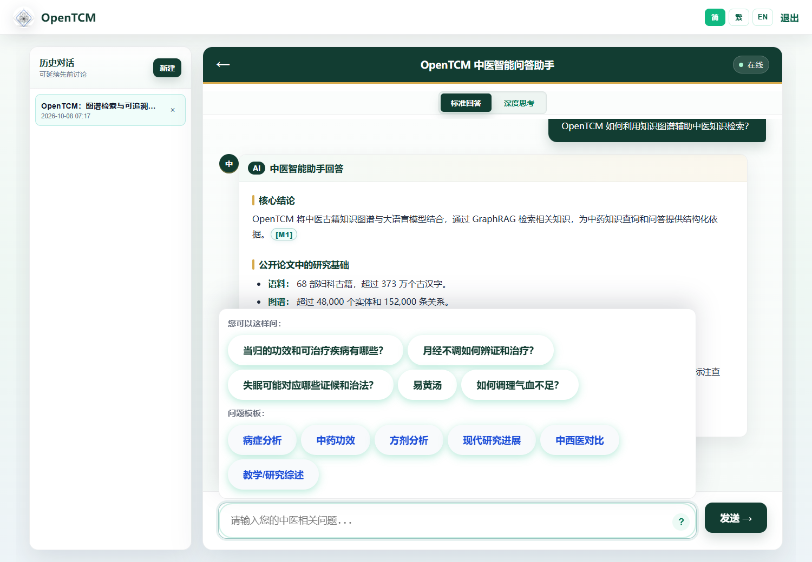
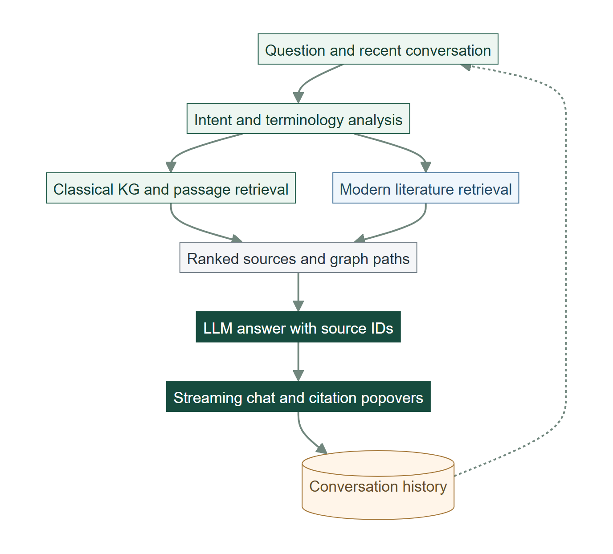

<div align="center">



### Source-traceable Traditional Chinese Medicine question answering

**中医智能问答助手 · 古籍知识图谱 · 现代文献 · 可追溯证据**

<p>
<a href="https://open-tcm.com/"></a>
<a href="https://arxiv.org/abs/2504.20118"></a>
<a href="https://restofworld.org/2026/traditional-chinese-medicine-ai-china/"></a>


</p>

<br />

🌐 [Website](https://open-tcm.com/) · 📄 [Paper](https://arxiv.org/abs/2504.20118) · 🖼️ [Interface](#-interface) · 🚀 [Quick Start](#-quick-start) · 中文 [说明](#-中文说明)

</div>

---

OpenTCM connects classical TCM knowledge graphs with modern literature and large language models. Ask about a herb, a formula, a symptom, or a research topic; explore the relationships behind an answer; and inspect the passages and article metadata attached to its citations.

Designed for **literature research, expert reference, and TCM education**, the web app supports Simplified Chinese, Traditional Chinese, and English. Access to the hosted expert-testing site is managed separately; credentials are not distributed in this repository.

## 🖼️ Interface

### Welcome to OpenTCM

<a href="https://open-tcm.com/"></a>

### Chat, Answer Modes, and Question Templates



<details>
<summary>🔎 Inspect a source citation</summary>



</details>

<details>
<summary>🧩 See the question templates</summary>



</details>

*Screenshots show the real interface in a fresh offline session. The example text was prepared from the public OpenTCM paper to demonstrate answer rendering and citation popovers; it is not live model output. No expert conversation history or private research records are included.*

## ✨ What You Can Explore

| | Capability | What it provides |
| --- | --- | --- |
| 🌿 | **Herbs and formulas** | Effects, composition, combinations, indicated patterns, and cautions, with evidence links. |
| 🔗 | **Chained graph retrieval** | Relationships across diseases, symptoms, patterns, formulas, and herbs, alongside original passages. |
| 📚 | **Classical and modern evidence** | Classical excerpts and modern article abstracts, conclusions, and available publication metadata. |
| 🧭 | **Focused retrieval** | Query analysis, classical-term mapping, and source/category filters where supported. |
| ⚡ | **Standard answers** | A concise answer using retrieved evidence and the model's general knowledge. |
| 🧠 | **Deep reasoning mode** | Streamed retrieval and analysis stages followed by the answer. |
| 🗂️ | **Continuing conversations** | SQLite-backed history, context-aware follow-ups, and suggested next questions. |
| 🌐 | **Three languages** | 简体中文 · 繁體中文 · English, for both the interface and answers. |

Citation popovers let readers inspect the underlying evidence. Classical sources show the book, relative path, and passage; modern sources show available article metadata and extracted evidence. Missing fields and poor-quality PDF text remain limitations of the source material.

## 🔬 Research and Coverage

### 📄 OpenTCM Paper

[**OpenTCM: A GraphRAG-Empowered LLM-based System for Traditional Chinese Medicine Knowledge Retrieval and Diagnosis**](https://arxiv.org/abs/2504.20118)

Jinglin He, Yunqi Guo, Lai Kwan Lam, Waikei Leung, Lixing He, Yuanan Jiang, Chi Chiu Wang, Guoliang Xing, and Hongkai Chen · **arXiv:2504.20118 (2025)**

🏆 **BIGCOM 2025 · Best Paper Award**

The paper describes the original research system using **68 gynecological books**, more than **48,000 entities**, and **152,000 relationships**. The current web application adds paragraph-level indexing, modern-literature retrieval, multilingual interaction, and conversation management. These later features are not presented as evaluations from the 2025 paper.

For the original application code, see the [paper-era repository snapshot](https://github.com/OpenTCM01/OpenTCM/tree/fbba8f7315b61a9b8e9bab8890686d338d3cd8e0). The legacy `data/TCMKG.py` extraction script is retained for reference; it additionally requires the `openai` package and its own permitted source texts.

### 📰 In the News

[**Beijing enlists AI to bring traditional Chinese medicine into the future**](https://restofworld.org/2026/traditional-chinese-medicine-ai-china/) · Nicole Fan, **Rest of World**, 29 January 2026.

The article discusses AI in TCM and mentions OpenTCM's use of classical-book concepts for knowledge retrieval and education.

<details>
<summary>📎 Cite OpenTCM</summary>

```bibtex
@misc{he2025opentcm,
  title        = {OpenTCM: A GraphRAG-Empowered LLM-based System for Traditional Chinese Medicine Knowledge Retrieval and Diagnosis},
  author       = {Jinglin He and Yunqi Guo and Lai Kwan Lam and Waikei Leung and Lixing He and Yuanan Jiang and Chi Chiu Wang and Guoliang Xing and Hongkai Chen},
  year         = {2025},
  eprint       = {2504.20118},
  archivePrefix = {arXiv},
  primaryClass = {cs.IR},
  doi          = {10.48550/arXiv.2504.20118},
  url          = {https://arxiv.org/abs/2504.20118}
}
```

</details>

## 🏗️ How It Works



[Editable diagram source](docs/diagrams/opentcm-workflow.mmd)

**Flask** serves the app and streams results with server-sent events. **SQLite FTS5** provides an on-disk full-text search index: it finds relevant indexed terms without repeatedly scanning the entire JSONL corpus. Graph relations support chained retrieval; **DeepSeek** provides query analysis and answer generation through a configurable API endpoint/model.

## 🚀 Quick Start

**Requirements:** Python 3.10+, SQLite with FTS5, a DeepSeek API key, and a locally prepared classical KG index. The modern-literature index is optional.

```bash
git clone https://github.com/OpenTCM01/OpenTCM.git
cd OpenTCM
python -m venv .venv
```

Activate the environment:

```powershell
# Windows PowerShell
.\.venv\Scripts\Activate.ps1
Copy-Item .env.example .env
```

```bash
# macOS / Linux
source .venv/bin/activate
cp .env.example .env
```

Install dependencies and configure your **local** `.env`:

```bash
python -m pip install -r requirements.txt
python -c "import secrets; print(secrets.token_hex(32))"
```

Use the generated value for `FLASK_SECRET_KEY`, choose your own `OPENTCM_PASSWORD`, and provide `DEEPSEEK_API_KEY`. Keep `.env` private. `DEEPSEEK_REVIEWER_MODEL` selects the model; set it to a model available to your API account.

### 📚 Prepare Your Knowledge Indexes

The large corpora, source PDFs, extracted records, and SQLite databases are **not bundled** with this public code update. Supply data that you have permission to use, or obtain an authorized index separately.

For the classical corpus, place the paragraph records and normalized extractions locally at:

```text
data/deepseek_success_160k_index.jsonl
data/deepseek_outputs_normalized.jsonl
```

Then build the merged passage archive and FTS retrieval database:

```bash
python scripts/build_paragraph_kg_index.py --rebuild
```

Outputs include `data/paragraph_kg_index.jsonl`, `data/opentcm_kg.sqlite`, and a schema summary. Book titles are corrected from their relative paths; `中医辞典` is normalized to `中医词典`.

For an optional modern-literature collection, put permitted PDFs under `data/modern_literature/` and run:

```bash
python scripts/build_modern_literature_index.py
```

See [data preparation](docs/DATA_PREPARATION.md) for formats, output fields, and extraction limitations.

### 💬 Start the App

```bash
python app.py
```

Open **http://127.0.0.1:8000/** and enter the password you configured. Choose a language, select Standard or Deep Reasoning, and start a conversation. A missing classical index leaves the retrieval service unavailable until the index is supplied.

## ☁️ Deployment and Privacy

For a public installation, run the app with a production WSGI server and HTTPS. A Cloudflare Tunnel can connect your origin to a domain without publishing local network credentials. [Deployment instructions](docs/DEPLOYMENT.md) include a generic configuration example.

This release contains application source, guides, documentation, and approved UI assets. `.gitignore` excludes environment files, credentials, databases, raw data, conversation history, logs, local tunnel configuration, and unpublished research. Do not commit those files or screenshots containing private conversations.

The current password-gated app uses a **shared conversation store**, not separate user accounts. Deploy it for a trusted group; add per-user authentication and history isolation before a wider multi-user rollout.

## 🗃️ Repository Map

```text
OpenTCM/
├── app.py                       Flask routes, streaming, and conversation storage
├── GraphRAG.py                  Query analysis, graph/text retrieval, and LLM client
├── .env.example                 Placeholder configuration only
├── requirements.txt             Runtime dependencies
├── scripts/                     Classical and modern index builders
├── templates/                   Login, welcome, and chat pages
├── static/                      Styles and brand images
├── docs/                        Setup documentation and public screenshots
└── ultilization_guide/           Multilingual guides and disclaimer
```

## 🤝 Feedback

Use [GitHub Issues](https://github.com/OpenTCM01/OpenTCM/issues) for reproducible bugs and feature suggestions. Include the question, chosen language/mode, and software version; remove API keys, patient details, passwords, and private source material before posting.

## 🇨🇳 中文说明

OpenTCM 是基于知识图谱与大语言模型的中医智能问答平台，支持古籍原文、现代文献、链式检索、可点击出处、连续追问，以及简体、繁体和英文切换。

- 🌐 **使用网页版：** [open-tcm.com](https://open-tcm.com/)，专家测试访问凭证需单独获取。
- 🛠️ **本地运行：** 安装依赖，复制 `.env.example` 为 `.env`，设置自己的 API Key、登录密码和会话密钥，准备知识库后运行 `python app.py`。
- 📚 **数据说明：** 完整古籍库、文献 PDF、检索数据库和专家对话记录不随本次公开代码更新上传。
- 📄 **研究成果：** [arXiv 论文](https://arxiv.org/abs/2504.20118)；[Rest of World 报道](https://restofworld.org/2026/traditional-chinese-medicine-ai-china/)。

OpenTCM provides literature-based information for research, education, and expert reference. Generated answers require verification and do not replace an individual clinical assessment.
